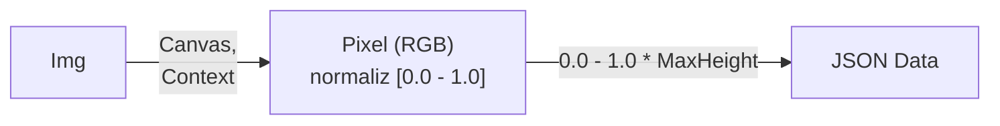
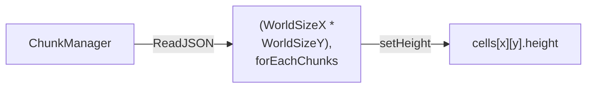
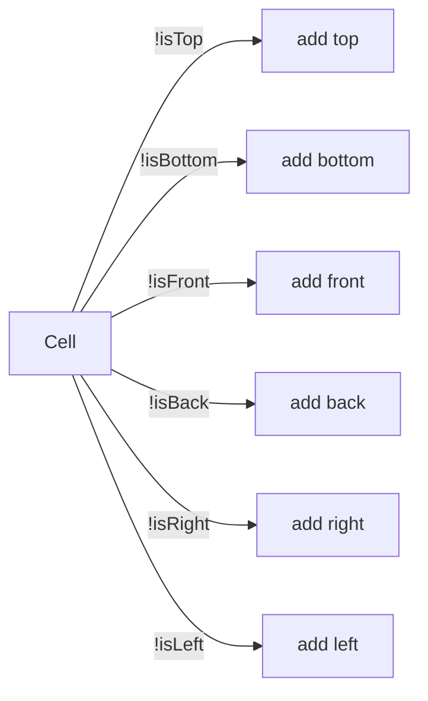

# 복셀

## 📝 프로젝트 개요

- Three JS 3D라이브러리를 통해 복셀 월드를 제작해보았습니다.
Height맵을 통해 지형 데이터를 파악하고, 그에 맞춰 박스 지오메트리를 생성합니다.
트라이앵글을 최소화 하기 위해 박스간의 메쉬 생성을 계산하여 보이지 않는 메쉬는 생성하지 않거나,
다수의 셀들을 하나의 청크로 머지하여 유효한 드로우콜 프레임을 확보하였습니다.

## 🛠️ 사용 기술
- 기술
  - JAVASCRIPT
- 라이브러리
  - THREE.JS

## 🔍 복셀 살펴보기
### 시연

https://github.com/user-attachments/assets/aacbd7eb-bdab-457c-9d2f-93b1fac7eccf

- 한반도 하이트맵을 통해 높이값을 지닌
월드가 생성 된 모습입니다.
  

https://github.com/user-attachments/assets/a7b96dae-75d6-4913-93a9-942d115c634c

- 런타임 중 블럭을 쌓거나, 제거하는
모습입니다.
  

https://github.com/user-attachments/assets/91a947b7-d5c0-49b4-b72a-8e4aea322273

- 와이어모드 및 청크 뷰를 통해
랜더큐브 및 청크 상태를 확인하는 모습입니다.
  

https://github.com/user-attachments/assets/08cfdfcf-7e9f-432d-b402-dbb4657cdf3a

- 청크내의 블럭이 변환 될 시 머지 및 컬링을 통해
보이지 않는 면은 렌더링하지 않는 모습입니다.
  

 
- 한반도 지형 하이트 맵
  

 
- 다른 지형 하이트 맵
  

 
- 와이어 프레임 모드
  

 
- 청크 뷰
  

 
- 보이지 않는 메쉬 렌더 컬링
  

## 📋 복셀 구현 기능 
- 이미지 지형 데이터 전환 & 읽기
- 런타임 큐브 생성 & 삭제
- 청크 머지 & 컬링

## 📝 복셀 다이어그램
### 프로세스 플로우
- 이미지를 캔버스 컨텍스트를 통해 해당 픽셀의 RGBA값을 확보하여 [0.0 - 1.0] 값으로 정규화합니다.
- RGB Hex 000000 값(검은색)이라면 최소 0.0의 값을, RGB Hex FFFFFF 값(하얀색)이라면 최대 1.0의 값을 가진,
- 정규화 값에 월드 최대 높이 값을 보정하여 월드 데이터값을 JSON으로 반환 합니다

- 청크 매니저를 통해 JSON 월드 데이터를 읽어들이고 설정된 값 만큼 청크들을 생성합니다.
`(청크는 n*n 만큼의 셀을 묶는 단위 및 객체입니다.)`
- 각 청크는 자신이 가지고 있는 셀에 접근하여 데이터 기반 높이 값을 설정합니다.
`(셀은 해당 x,y,z에 존재할 큐브, 6개의 면을 가지고 있는 정육면체 입니다.)`

 

- 셀은 청크 내의 주변 인접 셀 6면 위,아래,정면,후면,왼쪽,오른쪽 비교
`(top,bottom,front,back,left,right)`
근접한 셀이 존재한다면 현재 셀은 가려져, 보이지 않는 셀로 간주하여 통합 좌표 내에서 제외 컬링 최적화를 시도합니다.

 
 
 

- 청크 내의 셀들의 모든 좌표를 통합하여,
n개의 큐브 지오메트리가 아닌, 1개의 지오메트리로 병합 하여 드로우콜을 최적화 합니다.
`(여러개의 박스가 아닌 여러개 박스 모양을 지닌 하나의 도형으로 전환)`

 
 

## 최적화
### 컬링
- 한 개의 청크는 최대
 [ 가로 : 16 ] * [ 세로 : 16 ] * [ 높이 : 64 ] = 16,384개의 셀을 가질 수 있으니,
 [ 셀 : 16,384 ] * [ 정육면체 : 6 ] = 98,304개의 면을 가지게 되나 인접 면 컬링을 시도하면
- 6개의 면 중
 [ 가로 : 16 ] * [ 세로 : 16 ] * [ top,bottom : 2 ] = 512
 [ 가로 : 16 ] * [ 세로 : 64 ] * [ front,back,left,right : 4 ] = 4096
 4608면으로 최소화 할 수 있습니다.

### 머지
- 한 개의 청크는 최대
 [ 가로 : 16 ] * [ 세로 : 16 ] * [ 높이 : 64 ] = 16,384개의 셀을 가질 수 있으니,
 [ 월드 사이즈 가로 : 32 ] * [ 월드 사이즈 세로 : 32 ] = 1024개의 청크
 [ 종합 청크 : 1024 ] * [ 셀 : 16,384 ] = 16,777,216개의 지오 메트리를 가지게 되나
 머지를 통해 1024개의 지오메트리로 최적화 합니다.

### 결과
- [ 종합 청크 : 1024 ] + [ 커서 박스 : 1] = 지오메트리 1,025
 [ 면 : 698,680 ] * [ 폴리곤 : 2 ] = 폴리곤 1,397,360
 유효 60 프레임

 
 

## 📜 마무리
- 작업 일 : 2020. 00

